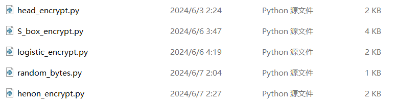
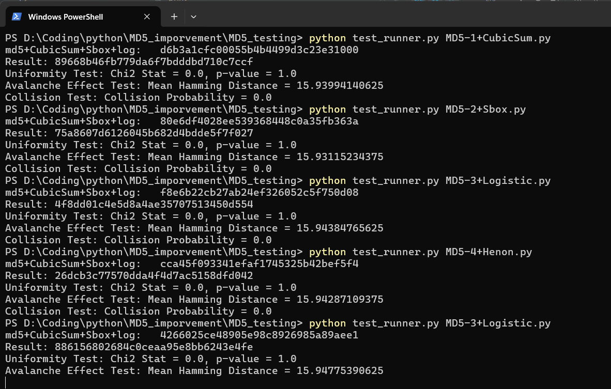

# MD5 优化算法测试

[TOC]


## 简单代码测试思路

为了对改良后的哈希算法进行数据均匀程度与混淆程度的分析，可以采用以下几个步骤和方法。这些测试旨在评估新算法的性能和安全性，包括其抵抗碰撞攻击和预映射攻击的能力，以及哈希值的均匀性和混淆特性。

### 1. 均匀程度测试（Uniformity Testing）

哈希值的均匀性意味着输出的哈希值在整个哈希空间内均匀分布。可以通过以下方法测试：

- **频率分析**：对大量不同的输入计算哈希值，统计每个哈希值出现的频率。理想情况下，每个哈希值出现的概率应接近均匀分布。
- **统计测试**：可以使用统计学中的卡方检验（Chi-square test）来确定哈希值是否均匀分布。具体步骤如下：
  - 生成大量不同的输入数据，并计算对应的哈希值。
  - 将哈希值划分为多个区间，统计每个区间内哈希值的数量。
  - 使用卡方检验检查这些数量是否符合均匀分布。

### 2. 混淆程度测试（Avalanche Effect）

Avalanche效应意味着输入的微小变化（如单个位的改变）会导致输出的哈希值发生大规模变化。可以通过以下方法测试：

- **单比特变化测试**：对一组输入数据，计算其原始哈希值，然后对每个输入数据仅改变一位，再计算新哈希值。比较原始哈希值和新哈希值的不同位数。理想情况下，改变输入的一个比特应导致输出哈希值约有一半的位发生变化（即约50%的位翻转）。
- **哈希差异统计**：对比不同输入的哈希值差异。计算原始输入和单比特变化输入的哈希值的汉明距离（Hamming Distance），即两者不同的位数。

### 3. 碰撞与抗碰撞测试（Collision Resistance Testing）

评估算法抗碰撞攻击的能力，即找到两个不同的输入产生相同哈希值的难度。

- **随机碰撞测试**：生成大量随机输入，计算哈希值并检查是否存在哈希值碰撞。此方法虽然不能证明抗碰撞性，但可以提供一些统计信息。
- **结构性碰撞测试**：采用已知的碰撞生成方法，测试新算法是否能抵抗这些攻击。

### 4. 实验实施

假设你有一个改良后的MD5算法 `modified_md5`，可以使用Python代码进行上述测试。

```python
import hashlib
import random
import string
import numpy as np
from scipy.stats import chisquare

# 模拟改良后的MD5算法函数
def modified_md5(data):
    # 在这里实现你改良后的MD5算法
    return hashlib.md5(data.encode()).hexdigest()

# 生成随机字符串
def random_string(length):
    return ''.join(random.choices(string.ascii_letters + string.digits, k=length))

# 均匀程度测试
def uniformity_test(num_samples=10000, hash_func=modified_md5):
    hash_buckets = {}
    for _ in range(num_samples):
        sample = random_string(20)
        hash_value = hash_func(sample)
        if hash_value not in hash_buckets:
            hash_buckets[hash_value] = 0
        hash_buckets[hash_value] += 1
    # 卡方检验
    frequencies = list(hash_buckets.values())
    chi2_stat, p_value = chisquare(frequencies)
    return chi2_stat, p_value

# 混淆程度测试
def avalanche_effect_test(sample, hash_func=modified_md5):
    original_hash = hash_func(sample)
    flipped_hashes = []
    for i in range(len(sample) * 8):  # Assuming sample is in bytes
        flipped_sample = bytearray(sample.encode())
        flipped_sample[i // 8] ^= (1 << (i % 8))
        flipped_hash = hash_func(flipped_sample.decode('utf-8', errors='ignore'))
        flipped_hashes.append(flipped_hash)
    # 计算汉明距离
    def hamming_distance(s1, s2):
        return sum(el1 != el2 for el1, el2 in zip(s1, s2))
    distances = [hamming_distance(original_hash, h) for h in flipped_hashes]
    return np.mean(distances)

# 示例测试执行
num_samples = 10000
chi2_stat, p_value = uniformity_test(num_samples=num_samples)
print(f"Uniformity Test: Chi2 Stat = {chi2_stat}, p-value = {p_value}")

sample = random_string(20)
mean_distance = avalanche_effect_test(sample)
print(f"Avalanche Effect Test: Mean Hamming Distance = {mean_distance}")
```

### 结果分析

- **均匀程度测试**：卡方检验的p值如果较高，表示哈希值分布接近均匀。通常，p值大于0.05被认为是均匀分布。
- **混淆程度测试**：汉明距离的平均值应接近哈希值长度的一半，例如对于128位的哈希值，理想平均距离应约为64位。

通过这些测试，可以评估改良后MD5算法的性能和安全性。如果结果表明均匀性和混淆性良好且无明显碰撞，则可以认为改良后的算法在这些方面有所改进。


------


## 测试代码项目化

我们将每个部分的代码放在独立的模块中，并在主程序中引入这些模块以保持代码清晰和模块化。以下是经过优化后的代码结构。

### 1. `modified_md5.py`
```python
import hashlib

def modified_md5(data):
    # 在这里实现你改良后的MD5算法
    return hashlib.md5(data.encode()).hexdigest()
```

### 2. `utils.py`
```python
import random
import string
import binascii

def random_string(length):
    #生成随机的字符串，注意不同MD5加密算法代码中规定输入数据类型的改变
    return ''.join(random.choices(string.ascii_letters + string.digits, k=length))
	
def random_bytes(length):
    random_bytes = bytes(''.join(random.choices(string.ascii_letters + string.digits, k=length)), 'utf-8')
    hex_representation = binascii.hexlify(random_bytes).decode('utf-8')
    return hex_representation
```

### 3. `uniformity_test.py`
```python
import json
import matplotlib.pyplot as plt
from scipy.stats import chisquare
#import random_bytes
from utils import random_bytes


def uniformity_test(num_samples, hash_func, output_dir):
    hash_buckets = {}
    for _ in range(num_samples):
        #sample = random_string(20)
        sample = random_bytes(256)
        hash_value = hash_func(sample)
        if hash_value not in hash_buckets:
            hash_buckets[hash_value] = 0
        hash_buckets[hash_value] += 1
    frequencies = list(hash_buckets.values())
    chi2_stat, p_value = chisquare(frequencies)

    # 输出到文件
    with open(f'{output_dir}/uniformity_test.json', 'w') as f:
        json.dump({'chi2_stat': chi2_stat, 'p_value': p_value, 'frequencies': frequencies}, f)

    # 绘制图表
    plt.hist(frequencies, bins=50)
    plt.title('Uniformity Test Histogram')
    plt.xlabel('Frequency')
    plt.ylabel('Count')
    plt.savefig(f'{output_dir}/uniformity_test_histogram.png')
    plt.close()

    return chi2_stat, p_value

```

### 4. `avalanche_effect_test.py`
```python
import json
import matplotlib.pyplot as plt
import numpy as np
from utils import random_bytes
from modified_md5 import md5
import os


# 确保输入是有效的十六进制字符串
def ensure_hex_string(s):
    try:
        bytes.fromhex(s)
        return True
    except ValueError:
        return False

# 混沌程度测试（Avalanche Effect）
def avalanche_effect_test(sample, hash_func, output_dir):
    while not ensure_hex_string(sample):
        sample = random_bytes(256)

    original_hash = hash_func(sample)
    flipped_hashes = []

    # 将输入转换为字节数组
    sample_bytes = bytearray.fromhex(sample)

    for i in range(len(sample_bytes) * 8):
        flipped_sample = sample_bytes[:]
        flipped_sample[i // 8] ^= (1 << (i % 8))
        flipped_sample_hex = flipped_sample.hex()

        while not ensure_hex_string(flipped_sample_hex):
            flipped_sample_hex = random_bytes.random_bytes(256)

        flipped_hash = hash_func(flipped_sample_hex)
        flipped_hashes.append(flipped_hash)

    def hamming_distance(s1, s2):
        return sum(el1 != el2 for el1, el2 in zip(s1, s2))

    distances = [hamming_distance(original_hash, h) for h in flipped_hashes]
    mean_distance = np.mean(distances)

    # 输出到文件
    if not os.path.exists(output_dir):
        os.makedirs(output_dir)

    with open(f'{output_dir}/avalanche_effect_test.json', 'w') as f:
        json.dump({'mean_distance': mean_distance, 'distances': distances}, f)

    # 绘制图表
    plt.hist(distances, bins=50)
    plt.title('Avalanche Effect Test Histogram')
    plt.xlabel('Hamming Distance')
    plt.ylabel('Count')
    plt.savefig(f'{output_dir}/avalanche_effect_test_histogram.png')
    plt.close()

    return mean_distance


def main():
    output_dir = 'output'
    sample = random_bytes(256)
    mean_distance = avalanche_effect_test(sample, hash_func=md5, output_dir=output_dir)
    print(f"Avalanche Effect Test: Mean Hamming Distance = {mean_distance}")


```

### 5. `collision_test.py`
```python
import json
from utils import random_bytes


def collision_test(num_samples, hash_func, output_dir):
    seen_hashes = set()
    collisions = 0
    for _ in range(num_samples):
        #sample = random_string(20)
        sample = random_bytes(256)
        hash_value = hash_func(sample)
        if hash_value in seen_hashes:
            collisions += 1
        else:
            seen_hashes.add(hash_value)

    collision_probability = collisions / num_samples if num_samples > 0 else 0

    # 输出到文件
    with open(f'{output_dir}/collision_test.json', 'w') as f:
        json.dump(
            {'num_samples': num_samples, 'collisions': collisions, 'collision_probability': collision_probability}, f)

    return collision_probability

```

### 6. `test_main.py`
```python
import os
import json
import matplotlib.pyplot as plt
from modified_md5 import md5
from uniformity_test import uniformity_test
from avalanche_effect_test import avalanche_effect_test
from collision_test import collision_test
from utils import random_bytes


def main():
    output_dir = 'output'
    if not os.path.exists(output_dir):
        os.makedirs(output_dir)

    num_samples = 10000

    # 均匀程度测试
    chi2_stat, p_value = uniformity_test(num_samples=num_samples, hash_func=md5, output_dir=output_dir)
    print(f"Uniformity Test: Chi2 Stat = {chi2_stat}, p-value = {p_value}")


    # 混淆程度测试
    #sample = random_string(20)
    sample = random_bytes(256)

    mean_distance = avalanche_effect_test(sample, hash_func=md5, output_dir=output_dir)
    print(f"Avalanche Effect Test: Mean Hamming Distance = {mean_distance}")

    # 碰撞测试
    collision_probability = collision_test(num_samples=num_samples, hash_func=md5, output_dir=output_dir)
    print(f"Collision Test: Collision Probability = {collision_probability}")

    # 汇总结果
    results = {
        'uniformity': {'chi2_stat': chi2_stat, 'p_value': p_value, 'frequencies': []},
        'avalanche': {'mean_distance': mean_distance, 'distances': []},
        'collision': {'num_samples': num_samples, 'collisions': 0, 'collision_probability': collision_probability}
    }

    # 读取单独的结果文件并合并到总结果中
    with open(f'{output_dir}/uniformity_test.json', 'r') as f:
        uniformity_data = json.load(f)
        results['uniformity'].update(uniformity_data)

    with open(f'{output_dir}/avalanche_effect_test.json', 'r') as f:
        avalanche_data = json.load(f)
        results['avalanche'].update(avalanche_data)

    with open(f'{output_dir}/collision_test.json', 'r') as f:
        collision_data = json.load(f)
        results['collision'].update(collision_data)

    with open(f'{output_dir}/results_summary.json', 'w') as f:
        json.dump(results, f)

    # 绘制综合结果图表
    plt.figure(figsize=(12, 6))
    plt.subplot(1, 3, 1)
    plt.bar(['Chi2 Stat'], [chi2_stat])
    plt.title('Uniformity Test Chi2 Stat')

    plt.subplot(1, 3, 2)
    plt.bar(['Mean Hamming Distance'], [mean_distance])
    plt.title('Avalanche Effect Test')

    plt.subplot(1, 3, 3)
    plt.bar(['Collision Probability'], [collision_probability])
    plt.title('Collision Test')

    plt.tight_layout()
    plt.savefig(f'{output_dir}/results_summary.png')
    plt.close()


if __name__ == "__main__":
    main()

```

#### 函数说明

1. **函数 `get_next_exp_dir`**：

   - 该函数用于确定下一个实验目录的名称。它会检查 `output` 目录下的现有文件夹，并找出最高的编号，然后生成新的实验目录名称。

   ```python
   def get_next_exp_dir(output_base_dir):
       exp_dirs = [d for d in os.listdir(output_base_dir) if d.startswith('exp')]
       exp_nums = [int(d[3:]) for d in exp_dirs if d[3:].isdigit()]
       next_exp_num = max(exp_nums, default=1) + 1 if exp_nums else 1
       return os.path.join(output_base_dir, f'exp{next_exp_num}')
   ```

2. **在 `main` 函数中使用 `get_next_exp_dir` 确定新实验目录**：

   - 调用 `get_next_exp_dir` 函数，创建新的实验目录，并将其赋值给 `exp_dir` 变量。

   ```python
   output_base_dir = 'output'
   exp_dir = get_next_exp_dir(output_base_dir)
   os.makedirs(exp_dir)
   ```

3. **在各个测试函数调用时使用 `exp_dir`**：

   - 将输出目录参数从 `output_dir` 修改为 `exp_dir`，确保测试结果保存到新的实验目录中。

这样，每次运行程序时，都会根据现有的 `output` 文件夹中的内容，创建一个新的实验文件夹（如 `exp2`、`exp3` 等），并将所有输出文件保存到该目录中。


### 7. test_runner.py

```python
import os
import sys
import importlib.util
import json
import matplotlib.pyplot as plt
import argparse
from uniformity_test import uniformity_test
from avalanche_effect_test import avalanche_effect_test
from collision_test import collision_test
from utils import random_string

def load_module(module_path, module_name="test_module"):
    spec = importlib.util.spec_from_file_location(module_name, module_path)
    module = importlib.util.module_from_spec(spec)
    sys.modules[module_name] = module
    spec.loader.exec_module(module)
    return module

def get_next_exp_dir(output_base_dir):
    """Determine the next available experiment directory name."""
    exp_dirs = [d for d in os.listdir(output_base_dir) if d.startswith('exp')]
    exp_nums = [int(d[3:]) for d in exp_dirs if d[3:].isdigit()]
    next_exp_num = max(exp_nums, default=1) + 1 if exp_nums else 1
    return os.path.join(output_base_dir, f'exp{next_exp_num}')

def main(test_file):
    base_dir = os.path.dirname(os.path.abspath(__file__))
    output_base_dir = os.path.join(base_dir, 'output')

    # 获取模块文件夹的路径
    module_dir = os.path.join(base_dir, 'module')

    # 动态加载测试文件
    test_module = load_module(os.path.join(module_dir, 'MD5.py'), 'test_module')

    # 获取MD5函数
    md5 = test_module.md5

    exp_dir = get_next_exp_dir(output_base_dir)
    os.makedirs(exp_dir)

    num_samples = 10000

    # 均匀程度测试
    chi2_stat, p_value = uniformity_test(num_samples=num_samples, hash_func=md5, output_dir=exp_dir)
    print(f"Uniformity Test: Chi2 Stat = {chi2_stat}, p-value = {p_value}")

    # 混淆程度测试
    sample = random_string(20)
    mean_distance = avalanche_effect_test(sample, hash_func=md5, output_dir=exp_dir)
    print(f"Avalanche Effect Test: Mean Hamming Distance = {mean_distance}")

    # 碰撞测试
    collision_probability = collision_test(num_samples=num_samples, hash_func=md5, output_dir=exp_dir)
    print(f"Collision Test: Collision Probability = {collision_probability}")

    # 汇总结果
    results = {
        'uniformity': {'chi2_stat': chi2_stat, 'p_value': p_value, 'frequencies': []},
        'avalanche': {'mean_distance': mean_distance, 'distances': []},
        'collision': {'num_samples': num_samples, 'collisions': 0, 'collision_probability': collision_probability}
    }

    # 读取单独的结果文件并合并到总结果中
    with open(f'{exp_dir}/uniformity_test.json', 'r') as f:
        uniformity_data = json.load(f)
        results['uniformity'].update(uniformity_data)

    with open(f'{exp_dir}/avalanche_effect_test.json', 'r') as f:
        avalanche_data = json.load(f)
        results['avalanche'].update(avalanche_data)

    with open(f'{exp_dir}/collision_test.json', 'r') as f:
        collision_data = json.load(f)
        results['collision'].update(collision_data)

    with open(f'{exp_dir}/results_summary.json', 'w') as f:
        json.dump(results, f)

    # 绘制综合结果图表
    plt.figure(figsize=(12, 6))
    plt.subplot(1, 3, 1)
    plt.bar(['Chi2 Stat'], [chi2_stat])
    plt.title('Uniformity Test Chi2 Stat')

    plt.subplot(1, 3, 2)
    plt.bar(['Mean Hamming Distance'], [mean_distance])
    plt.title('Avalanche Effect Test')

    plt.subplot(1, 3, 3)
    plt.bar(['Collision Probability'], [collision_probability])
    plt.title('Collision Test')

    plt.tight_layout()
    plt.savefig(f'{exp_dir}/results_summary.png')
    plt.close()

if __name__ == "__main__":
    parser = argparse.ArgumentParser(description='Run MD5 tests on a given MD5 implementation.')
    parser.add_argument('test_file', type=str, help='Path to the MD5 implementation file to test.')
    args = parser.parse_args()

    main(args.test_file)

```

#### 使用说明

该测试脚本利用 Python 的 `argparse` 模块来解析命令行参数，并动态导入需要测试的代码文件。

它将接受两个命令行参数：主文件和需要测试的代码文件。

##### 使用命令行运行测试

确保在命令行中运行以下命令：

```sh
python MD5_testing\test_runner.py MD5.py
```

##### 目录结构

确保你的目录结构如下：

```
./MD5_imporvement/
│
├── MD5/ ------MD5加密算法
│   ├── MD5.py
│   ├── random_bytes.py
│   └── head_encrypt.py
│
└── MD5_testing/ ----测试项目文件
    ├── test_runner.py
    ├── uniformity_test.py
    ├── avalanche_effect_test.py
    ├── collision_test.py
    ├── utils.py
    ├── output/ (自动生成)
    └── module/
        └── MD5.py

```

##### 加密算法代码要求

1.不能存在其他导入的第三方库，否则需要在 `test_runner.py`所在文件夹中放入第三方库的py文件后才能用命令行测试

module中使用的第三方库如下:（如果用其他模型，则这部分文件可删除）



2.加密算法输入为十六进制字符串，否则需要修改输入部分


要运行测试，可以按照以下步骤操作：

1.打开命令行终端。

2.导航到 `D:\Coding\python\MD5_imporvement\MD5_testing` 目录中。例如：

```
cd D:\Coding\python\MD5_imporvement\MD5_testing
```

3.然后运行以下命令：

```
python test_runner.py module\MD5.py
```

这样将会运行测试脚本，并测试位于 `MD5_testing\module` 目录下的 `MD5.py` 文件中的 MD5 实现。测试结果将会保存在 `MD5_testing\output` 目录中。

##### 命令行测试结果




### 解释

1. **`modified_md5.py`**：包含改良后的MD5算法实现。
2. **`utils.py`**：包含生成随机字符串的工具函数。
3. **`uniformity_test.py`**：实现均匀程度测试，并将结果输出到文件并绘制图表。生成大量随机字符串，计算哈希值频率，并进行卡方检验。结果保存在 `output/uniformity_test.json` 文件中，并绘制频率分布图 `output/uniformity_test_histogram.png`。
4. **`avalanche_effect_test.py`**：实现混淆程度测试，并将结果输出到文件并绘制图表。对一个输入的每个位进行翻转，计算翻转前后哈希值的汉明距离，结果保存在 `output/avalanche_effect_test.json` 文件中，并绘制汉明距离分布图 `output/avalanche_effect_test_histogram.png`。
5. **`collision_test.py`**：实现碰撞测试，并将结果输出到文件。生成大量随机字符串，计算哈希值并检查碰撞次数，结果保存在 `output/collision_test.json` 文件中。
6. **`test_main.py`**：主程序，引入其他模块，执行各项测试，并汇总结果输出到文件夹中，生成综合结果图表。输出文件夹位于 `output/exp` 路径中，并且每次运行程序时自动为文件夹命名（如 `exp2`、`exp3` 等），可以在主函数 `main` 中添加一个逻辑，用于检查现有的文件夹并确定新文件夹的名称。
7. **`test_runner.py`**：实现每次通过命令行运行测试代码主文件和需要测试的代码文件

这种结构使得代码更清晰，易于维护和扩展。通过模块化，测试可以独立进行和修改，主程序负责协调和结果输出。


### 结果分析（json文件）

`results_summary.json` 文件包含了三种测试的结果，你可以通过读取这个文件来分析测试结果，并将这些结果展示给用户或用于进一步的研究。以下是如何使用该 JSON 文件的步骤和示例代码。

#### 步骤

1. **读取 JSON 文件**：使用 Python 读取 `results_summary.json` 文件。
2. **解析数据**：从 JSON 文件中提取数据。
3. **分析数据**：根据需要分析和使用数据，例如生成报告或图表。

#### result.py

运行`result.py`，读取和使用 `results_summary.json` 文件，并生成图表来展示结果。

```python
import json
import matplotlib.pyplot as plt


def load_results(file_path):
    with open(file_path, 'r') as file:
        return json.load(file)


def plot_uniformity_test(data):
    chi2_stat = data.get('chi2_stat', 0)
    p_value = data.get('p_value', 1)
    frequencies = data.get('frequencies', [])

    print(f"Uniformity Test Results:")
    print(f"  Chi2 Statistic: {chi2_stat}")
    print(f"  p-value: {p_value}")

    if frequencies:
        plt.hist(frequencies, bins=50)
        plt.title('Uniformity Test Histogram')
        plt.xlabel('Frequency')
        plt.ylabel('Count')
        plt.show()
    else:
        print("No frequency data available to plot.")


def plot_avalanche_effect_test(data):
    mean_distance = data.get('mean_distance', 0)
    distances = data.get('distances', [])

    print(f"Avalanche Effect Test Results:")
    print(f"  Mean Hamming Distance: {mean_distance}")

    if distances:
        plt.hist(distances, bins=50)
        plt.title('Avalanche Effect Test Histogram')
        plt.xlabel('Hamming Distance')
        plt.ylabel('Count')
        plt.show()
    else:
        print("No distance data available to plot.")


def plot_collision_test(data):
    num_samples = data.get('num_samples', 0)
    collisions = data.get('collisions', 0)
    collision_probability = data.get('collision_probability', 0)

    print(f"Collision Test Results:")
    print(f"  Number of Samples: {num_samples}")
    print(f"  Collisions: {collisions}")
    print(f"  Collision Probability: {collision_probability}")

    plt.bar(['Collision Probability'], [collision_probability])
    plt.title('Collision Test')
    plt.ylabel('Probability')
    plt.show()


def main():
    results = load_results('output/results_summary.json')

    plot_uniformity_test(results['uniformity'])
    plot_avalanche_effect_test(results['avalanche'])
    plot_collision_test(results['collision'])


if __name__ == "__main__":
    main()

```


#### 解释

1. **读取 JSON 文件**：
    - `load_results` 函数从指定路径读取 JSON 文件并解析为 Python 字典。

2. **解析和展示均匀程度测试结果**：
    - `plot_uniformity_test` 函数解析均匀程度测试的结果，打印卡方统计量和 p 值，并绘制哈希值频率直方图。

3. **解析和展示混淆程度测试结果**：
    - `plot_avalanche_effect_test` 函数解析混淆程度测试的结果，打印平均汉明距离，并绘制汉明距离的直方图。

4. **解析和展示碰撞测试结果**：
    - `plot_collision_test` 函数解析碰撞测试的结果，打印样本数量、碰撞次数和碰撞概率，并绘制碰撞概率的柱状图。

5. **主程序**：
    - `main` 函数调用上述函数加载 JSON 文件，并分别展示三个测试的结果。
    - 使用 `list_exp_folders` 函数获取 `output` 目录下所有以 "exp" 开头的文件夹
    - 在 `main` 函数中，打印可用的实验文件夹列表，提示用户选择其中一个文件夹。
    - 根据用户的选择，读取对应文件夹中的 `results_summary.json` 文件并调用相应的函数进行可视化展示。

#### 使用方法

1. 确保 `output` 目录下存在以 "exp" 开头的文件夹，并且这些文件夹中包含 `results_summary.json` 文件。
2. 运行脚本时，会提示用户选择一个实验文件夹，然后读取并显示相应的测试结果。
3. 运行该示例代码，将展示三个测试的结果，并打印详细信息。
4. 可以根据需要对结果进行进一步分析或保存图表。

#### 分析结果

- **均匀程度测试**：
    - 通过卡方统计量和 p 值判断哈希值分布的均匀性。如果 p 值较大，说明哈希值分布接近均匀。

- **混淆程度测试**：
    - 通过平均汉明距离判断输入变化一个比特位时哈希值的变化程度。如果平均汉明距离接近哈希值长度的一半（例如64位哈希值应接近32），说明算法的混淆效果好。

- **碰撞测试**：
    - 通过碰撞次数和碰撞概率评估算法的抗碰撞能力。碰撞概率越低，算法越安全。

这种方法可以帮助开发者评估改良后的MD5算法在均匀性、混淆性和抗碰撞性方面的表现，并据此进行进一步的优化和改进。

